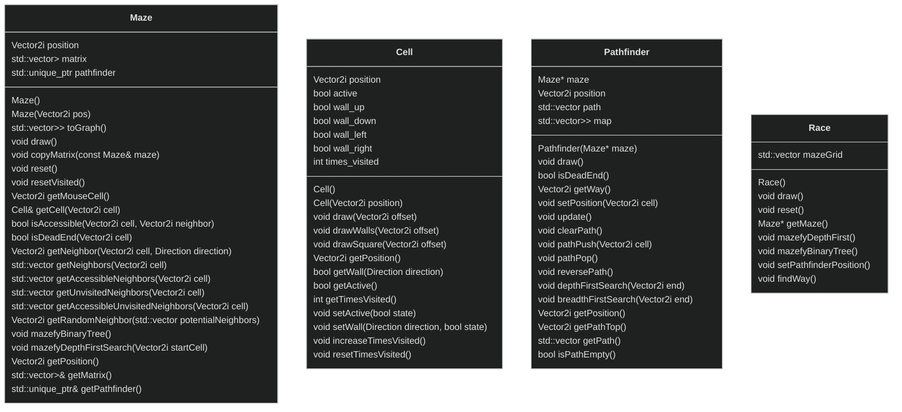

# MazeTrix: a graph traversal algorithm visualizer (with mazes)


https://github.com/goerll/MazeTrix/assets/90577512/0c1f6a26-a45d-4d77-a9eb-2fb9dc103ff4


## Index
- [Introduction](#introduction)
- [Features](#features)
- [Usage](#description)
- [Project Structure](#project-structure)
- [Algorithms Used](#algorithms-used)
- [Acknowledgements](#acknowledgements)

## Introduction
The goal of this project is to provide a  **cool looking**, real-time visualization of maze generation algorithms and a visual comparison of graph traversal algorithms while allowing the user to control the whole thing.

## Features
### Maze Grid
The program displays a grid consisting of two mazes that mirror each other, if you mazefy one of them, the maze is copied to the other one too.

https://github.com/goerll/MazeTrix/assets/90577512/88f48e2e-71fa-4861-a546-4469ecf8cde7


### Pathfinders
Each maze has a pathfinder and they also mimick each other, but the pathfinder on the left maze will always find it's way to other positions through the depth first search algorithm, and the one on the right will always use breadth first search, see who get's there faster!

https://github.com/goerll/MazeTrix/assets/90577512/ce7bd07c-e39c-4909-af2e-2c771a18b29d

## Usage
### Compiling and Running
``` bash
# Compile
Cmake .
make
# Run
./bin/MazeTrix
```
### Keybinds
| Key | Alt | Function |
| - | - | - |
| <kbd>D</kbd> | - | Generates maze with depth first search starting on the cell at mouse |
| <kbd>B</kbd> | - | Generates maze using the binary tree algorithm on the maze at mouse |
| <kbd>P</kbd> | <kbd>🖱️ LMB</kbd> | Place pathfinders at cell at mouse |
| <kbd>O</kbd> | <kbd>🖱️ RMB</kbd> | Make pathfinders find their way to where the mouse is |

## Project Structure


## Algorithms Used
### Generation
- Depth First Search
- Binary Tree
### Solving
These use an adjacency list that represents the maze in the form of a graph.
- Depth First Search
- Breadth First Search

## Acknowledgements
This project was created for my Object Oriented Programming II class on my third semester in college. Special thanks to [SamVeras](www.github.com/SamVeras) for suggesting raylib and helping me immensely with final stage debugging and to [JotaEspig](www.github.com/JotaEspig) for setting up the Cmake for the project.
